```mermaid
timeline
    title 📌 Timeline des Challenges Terraform

    section 🟢 Facile (400 pts)
      🔹 Initialiser un projet Terraform ➝ [Démarrer un projet] : 80 pts
      🔹 Définir un provider local ➝ [Utiliser Terraform sans cloud] : 80 pts
      🔹 Déployer une machine virtuelle avec libvirt ➝ [Créer une VM locale] : 80 pts
      🔹 Gérer un réseau privé ➝ [Configurer une infrastructure réseau] : 80 pts
      🔹 Utiliser des variables et outputs ➝ [Paramétrer dynamiquement] : 80 pts
    
    section 🟠 Moyen (600 pts)
      🔹 Gérer les états Terraform ➝ [Sauvegarder et gérer les états] : 120 pts
      🔹 Utiliser des modules Terraform ➝ [Réutiliser du code] : 120 pts
      🔹 Déployer un service Docker ➝ [Automatiser un conteneur] : 120 pts
      🔹 Configurer un Load Balancer local ➝ [Distribuer la charge] : 120 pts
      🔹 Utiliser un backend Terraform sur un serveur local ➝ [Stocker l’état distant] : 120 pts

    section 🔴 Difficile (500 pts)
      🔹 Gérer des utilisateurs et accès ➝ [Créer et gérer des accès] : 100 pts
      🔹 Automatiser Terraform avec GitHub Actions ➝ [Déploiement automatisé] : 100 pts
      🔹 Déployer un Kubernetes Cluster avec K3s ➝ [Créer un cluster K3s] : 100 pts
      🔹 Configurer des secrets avec Vault ➝ [Gérer des credentials sécurisés] : 100 pts
      🔹 Utiliser Terraform avec Ansible ➝ [Combiner Ansible et Terraform] : 100 pts

    section 🟣 Expert (500 pts)
      🔹 Gérer des rôles et permissions locales ➝ [Contrôler les accès locaux] : 100 pts
      🔹 Sécuriser un projet Terraform ➝ [Appliquer les meilleures pratiques] : 100 pts
      🔹 Optimiser un module Terraform ➝ [Réduire la complexité] : 100 pts
      🔹 Implémenter du CI/CD avec Terraform ➝ [Automatiser le pipeline] : 100 pts
      🔹 Déployer une infrastructure hybride ➝ [Gérer du local et du multi-cloud open-source] : 100 pts
```

## 🟢 Facile (400 points)

- **Initialiser un projet Terraform** *(80 pts)*  
  - **Objectif :** Apprendre à initialiser un projet Terraform et préparer son environnement.  
  - **Explication :** Terraform utilise des fichiers `.tf` pour définir l’infrastructure sous forme de code. `terraform init` initialise le projet en téléchargeant les dépendances nécessaires.

- **Définir un provider local** *(80 pts)*  
  - **Objectif :** Utiliser Terraform avec un provider local comme `libvirt`.  
  - **Explication :** Les providers définissent les ressources Terraform. `libvirt` permet de gérer des VMs sur un hyperviseur local.

- **Déployer une machine virtuelle avec libvirt** *(80 pts)*  
  - **Objectif :** Créer une machine virtuelle sur un hyperviseur local.  
  - **Explication :** Terraform peut provisionner des VMs en spécifiant leur CPU, RAM, et disque dur via `libvirt_domain`.

- **Gérer un réseau privé** *(80 pts)*  
  - **Objectif :** Créer un réseau isolé pour les machines locales.  
  - **Explication :** `libvirt_network` permet de configurer un réseau virtuel où les VMs peuvent communiquer sans accès direct à Internet.

- **Utiliser des variables et outputs** *(80 pts)*  
  - **Objectif :** Rendre le code Terraform dynamique et réutilisable avec des variables et outputs.  
  - **Explication :** `variable` permet de définir des paramètres dynamiques, tandis que `output` affiche des résultats après l’exécution.

---

## 🟠 Moyen (600 points)

- **Gérer les états Terraform** *(120 pts)*  
  - **Objectif :** Stocker et gérer l’état d’infrastructure localement ou sur un serveur privé.  
  - **Explication :** Terraform conserve l’état de l’infrastructure dans un fichier `.tfstate`, qui peut être stocké en local ou sur un serveur distant.

- **Utiliser des modules Terraform** *(120 pts)*  
  - **Objectif :** Organiser l’infrastructure en modules réutilisables.  
  - **Explication :** Les modules permettent de factoriser et réutiliser le code Terraform pour différents environnements.

- **Déployer un service Docker** *(120 pts)*  
  - **Objectif :** Utiliser Terraform pour gérer et déployer des conteneurs Docker.  
  - **Explication :** Le provider `docker` permet de gérer des conteneurs et des images Docker via Terraform.

- **Configurer un Load Balancer local** *(120 pts)*  
  - **Objectif :** Déployer un équilibreur de charge local.  
  - **Explication :** Terraform peut configurer un proxy de type HAProxy ou Traefik pour répartir la charge entre plusieurs services locaux.

- **Utiliser un backend Terraform sur un serveur local** *(120 pts)*  
  - **Objectif :** Stocker l’état Terraform sur un serveur distant sécurisé.  
  - **Explication :** Terraform peut utiliser un backend HTTP local pour centraliser l’état des infrastructures.

---

## 🔴 Difficile (500 points)

- **Gérer des utilisateurs et accès avec Terraform** *(100 pts)*  
  - **Objectif :** Créer et gérer des comptes utilisateurs et permissions sur une infrastructure locale.  
  - **Explication :** Terraform permet de gérer des fichiers d’authentification et de permissions avec `local_file` ou des modules Ansible.

- **Automatiser Terraform avec GitHub Actions** *(100 pts)*  
  - **Objectif :** Mettre en place un pipeline CI/CD pour Terraform.  
  - **Explication :** Terraform peut être exécuté automatiquement avec GitHub Actions pour valider et appliquer des changements.

- **Déployer un Kubernetes Cluster avec K3s** *(100 pts)*  
  - **Objectif :** Installer et gérer un cluster K3s avec Terraform.  
  - **Explication :** Terraform peut automatiser l’installation de K3s sur plusieurs machines locales.

- **Configurer des secrets avec Vault** *(100 pts)*  
  - **Objectif :** Gérer des secrets en toute sécurité avec HashiCorp Vault.  
  - **Explication :** Terraform permet de stocker et récupérer des secrets via Vault pour éviter de les exposer dans le code.

- **Utiliser Terraform avec Ansible** *(100 pts)*  
  - **Objectif :** Exécuter des configurations Ansible après un déploiement Terraform.  
  - **Explication :** Terraform provisionne l’infrastructure et Ansible configure les applications installées sur celle-ci.

---

## 🟣 Expert (500 points)

- **Gérer des rôles et permissions locales** *(100 pts)*  
  - **Objectif :** Définir des permissions avancées pour sécuriser l’infrastructure.  
  - **Explication :** Terraform permet de configurer des rôles avec des fichiers d’authentification locaux.

- **Sécuriser un projet Terraform** *(100 pts)*  
  - **Objectif :** Appliquer des bonnes pratiques pour protéger l’infrastructure.  
  - **Explication :** Vérifier les permissions, éviter les secrets en dur et stocker l’état de manière sécurisée.

- **Optimiser un module Terraform** *(100 pts)*  
  - **Objectif :** Améliorer la réutilisation et l’efficacité d’un module Terraform.  
  - **Explication :** Refactoriser et modulariser le code pour le rendre plus maintenable.

- **Implémenter du CI/CD avec Terraform** *(100 pts)*  
  - **Objectif :** Automatiser les déploiements via un pipeline GitLab CI/CD ou Jenkins.  
  - **Explication :** Terraform peut être intégré dans un pipeline pour valider et appliquer les changements automatiquement.

- **Déployer une infrastructure hybride** *(100 pts)*  
  - **Objectif :** Gérer un environnement multi-serveurs avec des outils open-source.  
  - **Explication :** Terraform permet d’orchestrer une infrastructure combinant Docker, Kubernetes et Ansible en local.

---
